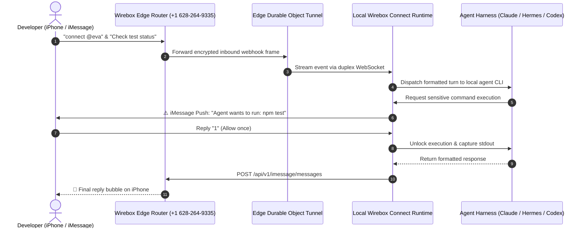

**Agent Connect** (`wirebox connect`) connects autonomous AI coding agents running on your local machine (such as **Claude Code**, **Hermes Agent**, **OpenAI Codex**, or **OpenCode**) directly to real-world communication channels — including Apple iMessage, SMS, and email inboxes.

With Agent Connect, you can message your development agent while away from your desk, ask it to review code, run test suites, check deployment status, or fix bugs, and receive interactive approval prompts on your phone before sensitive commands execute.

---

## Architecture & How It Works

Agent Connect establishes a secure, outbound-only WebSocket duplex tunnel between your local environment and the Wirebox Edge routing layer. Incoming webhook events from iMessage, SMS, and email are decrypted, parsed, and dispatched into the appropriate local agent harness.



---

## Quickstart

### 1. Zero-Setup Execution (`npx`)

You can launch Agent Connect immediately without installing any permanent global packages:

```bash
npx @wirebox-sh/cli connect @eva --driver hermes
```

Or using globally installed `wirebox`:

```bash
# Connect with default agent driver (auto-detects installed CLI)
wirebox connect @eva

# Explicitly specify driver and workspace directory
wirebox connect @eva --driver claude-code --dir ~/Engineer/my-project
```

### 2. Test from Your iPhone

1. Open **Messages** on your iPhone or Mac.
2. Text `connect @<agent_handle>` (for example, `connect @eva`) to the Wirebox router line:
   ```text
   +1 (628) 264-9335
   ```
3. Once paired, send any instruction (e.g. *"Run git status and summarize pending changes"*).
4. Watch your local agent process the task and text the answer back to your phone.

<Tip>
You can also generate an instant QR code to scan with your iPhone camera by running `wirebox imessage router <agent_handle>`.
</Tip>

---

## Supported Agent Drivers

Wirebox Connect features native drivers for major autonomous coding agent CLIs. It automatically detects which agents are installed on your system:

| Driver Name | CLI Command | Description |
| :--- | :--- | :--- |
| **`claude-code`** | `claude` | Anthropic's official Claude Code CLI with full project workspace and bash tool access |
| **`hermes`** | `hermes` | NousResearch's open-source autonomous agent harness with memory, skills, and tools |
| **`codex`** | `codex` | OpenAI Codex CLI and agent execution runner |
| **`opencode`** | `opencode` | OpenCode multi-provider autonomous terminal agent runner |

### Checking Driver Availability

To see which drivers are detected and available on your system, run:

```bash
wirebox connect drivers
```

Example output:
```text
🤖 Registered Agent Drivers:

• Claude Code [claude-code]
  Description: Anthropic's official CLI agent harness with full tool & project workspace access.
  Status:      ✓ Available (2.1.273)

• Hermes Agent [hermes]
  Description: NousResearch's open-source autonomous agent harness with memory, skills, and tools.
  Status:      ✓ Available (Hermes Agent v0.14.0)

• OpenAI Codex [codex]
  Description: Drives OpenAI Codex CLI / agent runner with project workspace tool execution.
  Status:      ✓ Available (codex-cli 0.153.4)

• OpenCode [opencode]
  Description: OpenCode autonomous coding agent runner with multi-provider model support.
  Status:      ✓ Available (1.18.23)
```

---

## Human-in-the-Loop Remote Approvals (HITL)

When you are away from your desk, safety is critical. An agent should not run destructive shell commands without human oversight.

Agent Connect includes a built-in **Escalation Manager**. Whenever an agent attempts to perform a sensitive action (such as executing bash scripts, pushing code, or triggering deployments), the local process is suspended, and an approval prompt is pushed directly to your phone:

```text
⚠️ [Action Required] Agent wants to execute: Bash Command
Command: git push origin main --force
Details: Pushing local changes to remote repository

Reply 1: Allow once
Reply 2: Always allow in this session
Reply 3: Deny
```

### Responding to Prompts:
* **Text `1` (or `yes`, `allow`)**: Approves the pending action once and resumes execution.
* **Text `2` (or `always`)**: Permanently whitelists this tool for the remainder of the current session.
* **Text `3` (or `no`, `deny`)**: Cancels the command. The agent receives an execution rejection notice and adjusts its strategy.

---

## Environment Diagnostics & Setup

### Diagnostic Doctor

Run connectivity, credential, and runtime checks before starting:

```bash
wirebox connect doctor
```

Output:
```text
🔍 Running Wirebox Agent Connect Doctor...

  ✓ Node.js runtime: v22.14.0 (Supported)
  ✓ Wirebox API: Connected (2 agent identities found)

🤖 Agent Driver Availability:
  ✓ Claude Code (claude-code): Available [2.1.273]
  ✓ Hermes Agent (hermes): Available [v0.14.0]

✨ Doctor check passed! Your environment is ready to connect.
```

### Interactive Setup Wizard

If configuring for the first time, run the interactive wizard:

```bash
wirebox connect init
```

The wizard prompts for your API key, lets you select from available agent handles, detects installed agent harnesses, chooses your default workspace directory, and optionally registers the daemon as a system background service.

### Live Scenario Simulation (`demo`)

Test the entire phone communication and approval escalation pipeline locally without needing a physical phone:

```bash
wirebox connect demo
```

---

## Background Daemon Management (macOS `launchd`)

You can run Agent Connect as an always-on background service on your Mac so your agents are accessible even when your terminal window is closed:

```bash
# Install and register the background service
wirebox connect daemon install --driver hermes --dir ~/Engineer/my-repo

# Check service status
wirebox connect daemon status

# View real-time log output
wirebox connect daemon logs

# Uninstall the service
wirebox connect daemon uninstall
```

<Note>
Background daemon configuration files are placed in `~/Library/LaunchAgents/sh.wirebox.connect.plist`. Logs are streamed to `~/.wirebox/connect.log`.
</Note>

---

## Security & Architecture

Agent Connect is designed with enterprise-grade isolation and zero-trust principles:

1. **Outbound-Only WebSocket**: The connection is initiated from your machine outward (`wss://api.wirebox.sh`). Your machine never binds or opens inbound listening ports on `0.0.0.0`, ensuring total invisibility to local network (LAN) scanners.
2. **HMAC-SHA256 Cryptographic Verification**: Inbound webhook events are verified with agent-scoped secrets (`whsec_...`). Spoofed or replayed HTTP requests are discarded before reaching the agent.
3. **Contact Allowlist**: Only paired contacts (such as your verified supervisor phone number or email) can invoke the agent. Unknown callers are ignored.
4. **Emergency Cut-off**: If you ever need to sever an agent's connectivity instantly, you can disable the tunnel from the [Wirebox Console](https://wirebox.sh/console) or via CLI:
   ```bash
   wirebox tunnel update @eva --status disabled
   ```
